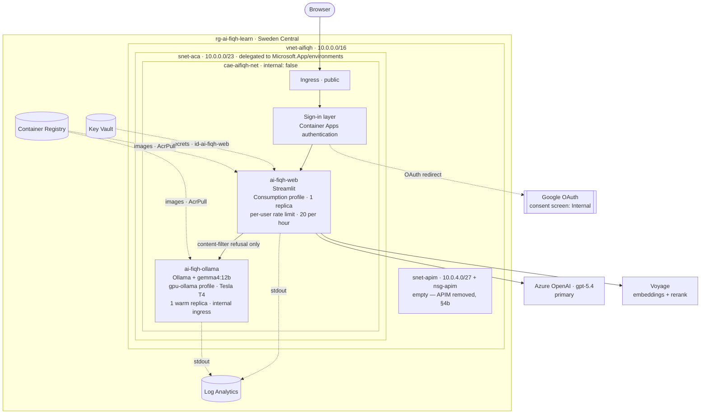

# AI-Fiqh — Deployment

**Status (2026-09-30):** deployed and working — both apps on Container Apps,
Google sign-in enforced, GPU fallback answering in ~14s, secrets in Key Vault,
logs in Log Analytics, all declared in Bicep. Runbooks: §7 (core), §7b
(sign-in).

**As of 2026-10-01** both apps run inside the VNet (`cae-aifiqh-net` in
`snet-aca`) with a public endpoint. APIM was built and removed — it cannot proxy
Streamlit's WebSocket (§4b) — and rate limiting lives in the app instead (§4c).
Current architecture: §4 *As built*. Still outstanding: private endpoints,
billing alerts, Application Insights, CI/CD. See `PROJECT_TRACKER.md` for build status — the app itself is
feature-complete; this is about putting it in front of users.

**Reframed 2026-09-16.** This is now explicitly a learning vehicle for
building and deploying AI applications on Azure, not just "ship the app
cheaply." That changes what "good" looks like here: depth of the Azure stack
and what it teaches now matters alongside cost and simplicity. Kept as an
explicit goal so later choices in this doc can be read against it.

**Working assumptions, current as of 2026-09-16:**

| Question | Answer |
|---|---|
| Audience | Public, low–medium traffic (tens to low hundreds of users) |
| Provider / tenant | **Resolved** — Azure, corporate policy permits this use (see §3) |
| Ollama fallback (`gemma4:12b`) | Keep it, self-hosted |
| Hosting stack | **Azure**, "Option A" shape (app + fallback model co-located in one environment) — see §4 |
| Cost approach | Right-size compute, minimize idle cost via auto-shutdown / scale-to-zero rather than run everything 24/7 |
| Learning scope | Full Azure-native stack: compute + Key Vault + Monitor/App Insights + IaC + CI/CD |
| Auth | Container Apps built-in auth, any signed-in identity let in (no allowlist). **Provider changed 2026-09-21: Google, not Entra ID** — the tenant blocks app registrations. See §4a |
| IaC tool | **Resolved 2026-09-17** — Bicep |
| Ollama cold start (§4c) | Bake-into-image confirmed working; **compute sizing changed** — Consumption's 8 GiB ceiling OOM-killed the model in local testing, moved to a Dedicated workload profile at 16 GiB. End-to-end Azure cold start still unmeasured |
| Rate limiting | **Changed 2026-09-30** — in the app, keyed on the signed-in user. APIM was built and removed: it cannot proxy Streamlit's WebSocket (§4b) |
| Networking | VNet + subnets deployed and kept (free, groundwork for private endpoints), but **unused** — the app runs in the original non-VNet environment |

Superseded from the previous pass: the Oracle Cloud free-tier VM idea (§4,
Option A originally) — Azure doesn't have an equivalent always-free shape
with enough RAM for a 12B model, and the brief has changed anyway now that
Azure is the explicit point of the exercise, not just the cheapest host.

---

## 1. What's actually being deployed

Unchanged from the first pass — restated because it still drives every
decision below:

| Property | Value | Why it matters for hosting |
|---|---|---|
| App | `src/ai_fiqh/app.py`, Streamlit, 3 tabs | Single Python process, stateless across sessions except `@st.cache_resource` |
| Retrieval index | `index/` — 1.3 MB (`chunks.json` + `embeddings.npy`, 177×1024 float32) | No vector DB, no external retrieval service. Ships as static files baked into the image; loads into memory once per process |
| Source PDF | `data/Fiqh Class Book.pdf`, 15 MB | **Not needed at runtime** — only `ingest.py` reads it. Don't ship `data/` to prod |
| Retrieval-time external calls | Voyage API (embeddings for grey-band multi-query, reranking) | Needs network egress + `VOYAGE_API_KEY`; billed per call |
| Generation | Azure OpenAI (default), Anthropic (`cloud` dep group), Ollama (fallback) | See §3 — provider/tenant question, now resolved |
| Concurrency model | Streamlit's default: one process, one thread per session rerun | Fine for read-only retrieval. LLM calls are per-request with `max_retries` + `guarded()` error handling already in place |
| Secrets | `.env` today: `VOYAGE_API_KEY`, `ANTHROPIC_API_KEY`, `AI_FIQH_LLM_PROVIDER`, `AZURE_OPENAI_ENDPOINT`/`_API_KEY`/`_DEPLOYMENT`, `AI_FIQH_LLM_FALLBACK_PROVIDER` | Moves to Key Vault (§4) — this is now a deliberate learning target, not just a chore |

---

## 2. The tension, restated for Azure

The original tension (free budget + self-hosted Ollama + public traffic) was
resolved for a generic cheap host by pointing at Oracle's free ARM tier.
That specific escape hatch doesn't exist on Azure:

- **Azure's free-tier VM allowance is a B1S** (1 vCPU, 1 GB RAM) — nowhere
  near enough to run `gemma4:12b`, which the tracker already measured
  needing real headroom at 16,384 context tokens.
- A VM actually sized for it — roughly a **B2ms class, ~2 vCPU / 8 GB RAM**
  — is real, ongoing money if left running 24/7. Rough order of magnitude
  from general Azure Linux VM pricing: **~$60–70/mo pay-as-you-go** — treat
  this as a planning estimate, not a quote; run it through the Azure Pricing
  Calculator before committing to a size.
- The brief also changed: since this is now explicitly about learning Azure
  deployment, the goal isn't "avoid Azure cost," it's "spend deliberately
  and learn the tools that make that spend controllable" — which is exactly
  what auto-shutdown / scale-to-zero patterns are for.

Given the chosen answers (scale-to-zero over 24/7, full Azure-native stack),
the natural fit is **Azure Container Apps** rather than a raw IaaS VM:
Container Apps supports true per-app scale-to-zero (via KEDA under the
hood), which an IaaS VM's "auto-shutdown schedule" only approximates (a
schedule turns the box off at a fixed time — it doesn't spin back up on the
next request without extra automation). Container Apps also happens to be
a more idiomatic "learn cloud-native Azure" surface than SSH-ing into a VM:
containers, managed identity, KEDA scaling rules, and a proper CI/CD path
onto a registry are all standard modern-Azure skills, which fits the
reframed goal directly.

---

## 3. Provider / tenant — resolved

Previously flagged as the thing that blocks shipping regardless of hosting
choice: Azure OpenAI was being accessed through a corporate Vodafone tenant,
which is a bigger acceptable-use question once traffic is public rather than
solo dev exercise.

**Resolved 2026-09-16:** corporate policy permits this use. Azure OpenAI
stays the production primary, per the existing `llm.py` default.

One thing worth a deliberate (not urgent) check before real public traffic
starts, purely as good practice rather than because anything is currently
wrong: confirm which subscription/resource group this deployment lands in —
a dedicated dev/learning subscription is cleaner than sharing quota, cost
attribution, and blast radius with other tenant workloads, if that choice is
available. Not a blocker, just worth being deliberate about once the Azure
resources are actually being provisioned.

---

## 4. Architecture — Azure-native, Container Apps

### As built (2026-10-01)

Verified against the live resource group, not the plan. Two container apps in
one VNet-integrated Container Apps environment, with sign-in in front and no
gateway:



| | |
|---|---|
| Public entry | Container Apps ingress on `ai-fiqh-web`, directly — no gateway (APIM could not proxy Streamlit's WebSocket, §4b) |
| Sign-in | Container Apps authentication with Google; consent screen *Internal*, so Vodafone Workspace accounts only (§4a) |
| Rate limiting | In the app, per signed-in user, 20 model calls per rolling hour (§4c) |
| Networking | In the VNet with a public endpoint (`internal: false`). Outbound calls to Azure OpenAI and Voyage still cross the public internet — no private endpoints yet |
| Fallback | Only on an Azure content-filter refusal; T4 replica kept warm because a cold start (~5½ min) exceeds the 240s ingress limit (§4c) |
| Identity | User-assigned managed identities `id-ai-fiqh-web` / `id-ai-fiqh-ollama`; no keys in images or `.env` |
| Source of truth | `infra/` + `infra/main.bicepparam` — the params file now records the VNet environment, so a plain redeploy reproduces this |

**Why two apps with different profiles, not one:** `ai-fiqh-web` is light
(1 vCPU / 2 GiB) and stays on Consumption. It is held at exactly one replica on
purpose — the retriever cache and the rate limiter both live in-process, so a
second replica would split both. `ai-fiqh-ollama` needs a GPU to answer inside
the ingress timeout at all (CPU inference took ~12 minutes per prompt, §4c), and
is kept warm because a GPU cold start cannot fit that timeout either.

### Components and what each one teaches

| Component | Status | Role | Learning surface |
|---|---|---|---|
| **Azure Container Registry (ACR)** | ✅ deployed | Stores the two images; built in Azure with `az acr build` (amd64) | Image build/push, registry auth via managed identity |
| **Container Apps environment** | ✅ deployed | Hosts both apps, in the VNet, with a Consumption and a T4 GPU workload profile | Workload profiles, KEDA scaling, ingress, cold starts |
| **VNet + subnets + NSG** | ✅ deployed | Environment sits in `snet-aca`; `snet-apim` empty | Subnet delegation and sizing, immutable network settings |
| **Key Vault** | ✅ deployed | Holds the API keys and the Google client secret | Secret references instead of env files, RBAC data-plane roles |
| **Managed identities** (user-assigned, one per app) | ✅ deployed | Pull images and read secrets with no stored credential | Why user-assigned beats system-assigned for first-start ordering |
| **Log Analytics** | ✅ deployed | Console and system logs for both apps, queried with KQL | Diagnosing from system events when a container never starts |
| **Bicep** (IaC) | ✅ in use | Declares everything; `main.bicepparam` holds the running state | Staged deployments, what-if, incremental mode's limits |
| **Container Apps authentication + Google** | ✅ deployed | Sign-in before any request reaches the app | OAuth redirect flow, principal headers — see §4a |
| **In-app rate limiter** | ✅ built (image `v4`) | Per-user cap on model calls | See §4c |
| **Application Insights** | ⏳ not built | Tracing and dashboards on top of the logs | — |
| **GitHub Actions + OIDC federated credential** | ⏳ not built | Build images, deploy revisions | Federated identity instead of a stored secret |
| **Private endpoints** (Key Vault, Azure OpenAI) | ⏳ next | Keep those calls off the public internet | The reason the VNet was kept |
| ~~Entra ID app registration~~ | ❌ blocked | — | Tenant forbids app registrations; Google used instead (§4a) |
| ~~Azure API Management~~ | ❌ removed | — | Cannot proxy Streamlit's WebSocket (§4b); revisit with a React + REST frontend |

## 4a. Authentication

### ⚑ 2026-09-21: Entra ID is not available from this account — Google instead

Building phase 2 started with a read of the tenant's authorization policy,
because an Entra ID sign-in needs an app registration:

```
allowedToCreateApps:    false
allowedToCreateTenants: false
directory roles held:   none
```

So no app registration can be created from this account, in the Vodafone
tenant or in a new one. The alternatives were asking the identity team (a
ticket, and likely only a single-tenant registration, which would make the
app Vodafone-only), registering in a personal Entra tenant (the sign-in for
a corporate-hosted app then lives outside Vodafone's governance), or a
different provider.

**Chosen: Google**, which Container Apps authentication supports natively,
with the OAuth client in the user's own Google Cloud project. Everything
else below still holds: the same platform-level mechanism, the same
policy (any signed-in person), the same identity headers. Google accounts
also suit a general public audience better than Microsoft ones. The
multi-tenant Entra configuration discussed further down no longer applies.

The same governance question applies to Google as to a personal Entra
tenant, since the OAuth client sits in a personal Google account. Worth
confirming it's covered by the policy that permits this project.

Implemented in `infra/modules/container-apps.bicep` (`webAuth`, conditional
on `googleClientId` being set) and `src/ai_fiqh/app.py` (`signed_in_line`).
Setup steps are runbook §7b.

### Original design (2026-09-16)

**Chosen 2026-09-16:** Container Apps' built-in **Authentication** add-on
(the platform-level "Easy Auth" pattern), provider **Microsoft Entra ID**,
policy **require authentication, any signed-in identity allowed in** — no
allowlist, no app roles. The point of auth here is "prove you're a real
person" for abuse/cost control, not gatekeeping who gets to use a public
Fiqh Q&A tool.

**Why platform-level rather than in-app (e.g. `streamlit-authenticator` or a
password gate):** the token validation happens before the request reaches
the container at all — the app never has to see, reject, or reason about an
unauthenticated request on a protected route. It's also the more transferable
skill: this is the same pattern App Service Easy Auth and Azure Functions
auth use, not something specific to this one app.

**One config decision worth being explicit about, since it changes who can
actually get in:** an Entra ID app registration defaults to accepting
accounts only from *this* tenant's organization. For "anyone who signs in"
to mean what it says for a public visitor — not "anyone with a Vodafone
work account" — the app registration needs **"Accounts in any organizational
directory and personal Microsoft accounts"** (multi-tenant + personal MSA).
That's the intended setting here; flagged explicitly because the narrower
default is easy to leave in place by accident and would quietly turn "public
app" into "internal tool."

**What the app gets after a successful sign-in:** Container Apps injects
`X-MS-CLIENT-PRINCIPAL*` headers into the request (base64-encoded principal
ID, display name, identity provider). Two things this unlocks, neither built
yet:

- Showing "signed in as ..." in the Streamlit UI — cheap, mostly cosmetic.
- **Per-user rate limiting**, keyed off the principal ID instead of IP —
  this directly closes the "abuse / cost control" item that's been open
  in §5 since the first pass of this doc. Auth turns that from "guess who's
  hammering the app" into "count requests per identity," which is a much
  more tractable problem.

**Not addressed by this:** Entra ID sign-in proves *someone signed in*, not
that they're a Muslim seeking Fiqh guidance in good faith — it's an abuse
throttle, not a content moderation layer. That distinction is worth keeping
in mind if abuse turns out to look like "many requests from one authenticated
account" rather than "many anonymous requests," since the mitigations differ.

## 4b. Rate limiting — Azure API Management

**Chosen 2026-09-17:** put Azure API Management in front of the Container
Apps environment as the app's one public entry point, using its
`rate-limit-by-key` policy rather than an app-level counter. This is the
more idiomatic Azure pattern for gateway-level throttling and adds a
genuinely useful second learning surface (API gateway policies) alongside
Container Apps' own primitives — but it changes the architecture in two
ways worth being explicit about, and creates one real open question.

**What changes:** per the updated diagram in §4, both `ai-fiqh-web` and
`ai-fiqh-ollama` move to **internal-only ingress**. APIM becomes the sole
public hostname, and needs a private path into the Container Apps
environment to reach them — i.e. the Container Apps environment gets
**VNet integration**, and APIM needs a tier that can either be deployed into
that VNet or peer with it. That's a real infrastructure decision, not a
detail: **the Consumption tier** (pay-per-call, no fixed hourly cost — the
tier that best matches the cost-minimization goal elsewhere in this doc)
has historically had limited or no VNet-integration support compared to the
Developer/Standard/Premium tiers, which do support it but carry a fixed
hourly cost whether or not the app is getting traffic — the same "always-on
cost" trade this doc has been trying to avoid for compute. **Not yet
resolved: which APIM tier actually satisfies both "reaches a privately
networked backend" and "doesn't reintroduce a fixed always-on cost."** Needs
a current tier-capability check before committing — API Management's tier
lineup has changed over time (newer "v2" tiers exist specifically to bring
VNet support to a cheaper tier than Premium), so verify against what's
actually offered now rather than trusting a recalled tier table.

**The real open question: what key does `rate-limit-by-key` actually use
here?** APIM's rate-limiting policies are built around request-level keys
that are available *before* any backend is involved — client IP, an APIM
subscription key, or a claim pulled out of a bearer token APIM validates
itself (`validate-jwt` + `rate-limit-by-key` on a token claim). That fits an
API client that already holds a token. It fits less cleanly here because:

- The identity this app cares about is resolved by **Container Apps'
  interactive OIDC login (Easy Auth)** — a browser redirect-and-cookie
  session — which happens *behind* APIM in the request path, not before it.
  On the first request from a not-yet-signed-in browser, APIM has no
  identity to key on yet; only Container Apps does, after the login
  redirect completes.
- Streamlit's UI traffic (WebSocket-based, not discrete REST calls) is also
  a less common APIM workload than the stateless API calls its policies are
  usually written for. Supported, per Azure's docs on WebSocket APIs
  through APIM, but worth confirming hands-on rather than assuming it
  behaves like a normal HTTP API once through the gateway.

**Not resolved yet — needs a spike, flagged the same way the Ollama
cold-start question was before it got measured:** two candidate shapes,
neither built:

1. **Two-tier limiting.** APIM does a coarse, identity-blind limit (by
   client IP or a fixed subscription key) in front of everything — cheap,
   works today, protects the login page and the whole app from raw floods.
   True per-user fairness (the thing auth in §4a was meant to unlock) falls
   back to a small app-level counter keyed on the
   `X-MS-CLIENT-PRINCIPAL-ID` header Container Apps injects after login —
   i.e. APIM handles volumetric protection, the app handles per-user
   fairness. Less "pure APIM," more realistic given the login flow.
2. **Push more of the app behind a token-bearing API surface.** If a small
   REST endpoint ever sits alongside the Streamlit UI (not planned yet, but
   plausible as a follow-on learning step), *that* surface is where
   APIM's `validate-jwt` + `rate-limit-by-key` work in their intended,
   textbook form — a genuinely cleaner APIM lesson, just not one that
   covers the interactive UI itself.

### ⚑ 2026-09-30: APIM cannot serve this UI — abandoned, rate limiting moves into the app

Built, deployed, and then removed. APIM Developer provisioned fine in the
VNet and its HTTP API worked, but **a WebSocket API's URL suffix cannot
contain a slash**, tested directly against the live instance:

| WebSocket API path | result |
|---|---|
| `stream` | created |
| `_stcore/stream` | rejected — *"Invalid value of the Web API URL suffix"* |

Streamlit serves its UI channel at `/_stcore/stream` and the path is not
configurable, so the gateway cannot match it. The page would load over HTTP
and then never connect. This is risk 1 from the phase 3 plan, realised.

**Decision: no gateway in front of the Streamlit UI.** Rate limiting moves
into the app, keyed on the signed-in principal from the identity header.
Reasons, in order:

1. **It is the better limiter anyway.** The two-tier compromise above existed
   only because APIM cannot see the identity — it is established behind the
   gateway. An in-app counter keys on the actual user rather than an IP.
2. **Application Gateway would work** (inside the VNet, native WebSockets,
   WAF rate limiting) at roughly $250/month — hard to justify for an app whose
   largest cost is already an always-on T4.
3. **APIM gets its proper turn if the frontend is ever rebuilt** as a React
   SPA plus a REST API: a bearer token on every request is exactly what
   `validate-jwt` + per-user `rate-limit-by-key` are designed for. That is a
   rewrite, not a fix, so it is a future phase rather than a repair.

**What was kept:** the VNet, subnets and NSG. They cost nothing and are the
groundwork for private endpoints to Key Vault and Azure OpenAI — a more useful
next networking step than a gateway. `snet-apim` sits empty.

**Correction, same day:** the first version of this decision left the apps
outside the VNet entirely and treated the VNet as scaffolding for later. That
under-sold it — VNet membership and public reachability are independent
settings, so the apps can sit in the VNet *and* keep a public endpoint
(`internal: false`). The rebuild cost is the same whenever it happens, so
there was no reason to defer it. `environmentInternal` is now a parameter,
defaulting to false, and §7d rebuilds the environment inside `snet-aca`.

**What was removed:** the APIM instance, the internal environment
`cae-aifiqh-vnet`, and the `-vnet` apps. The original public environment
continued serving throughout, which is why building alongside rather than
deleting first turned out to matter.

The phase 3 modules (`infra/modules/apim.bicep`, `network.bicep`,
`private-dns.bicep`) stay in the repo behind `useVnet` / `deployApim`, both
defaulting to false. Nothing recreates itself.

### Superseded: the original two-tier design (2026-09-24)

**Resolved 2026-09-24: option 1, built.** APIM rate-limits on
`@(context.Request.IpAddress)` — coarse and identity-blind, because the
identity is established behind the gateway, not in front of it. Per-user
fairness keyed on the principal would need an app-level counter and is not
built. Tier: **Developer**, the only affordable one supporting VNet
injection (Consumption supports none; Premium/Premium v2 are the
alternatives). Implemented in `infra/modules/apim.bicep`; runbook §7c.

Two things this forced, both verified rather than assumed:

- **A new environment.** `az containerapp env update` has no VNet flag — a
  VNet can only be set at creation. So phase 3 replaces `cae-aifiqh` with
  `cae-aifiqh-vnet`, and since an app cannot move between environments, the
  old one is deleted first. That means an outage of roughly an hour, most of
  it waiting for APIM to provision.
- **Manual private DNS.** An internal environment on a custom VNet has no DNS
  of its own, so `modules/private-dns.bicep` creates the zone, the VNet link
  and a wildcard A record to the environment's static IP. Without it APIM
  cannot resolve the backend at all.

### Considerations

- **Identity exists, but not in a form APIM reads natively.** Container
  Apps Easy Auth is cookie/session-based — it decodes the session into
  `X-MS-CLIENT-PRINCIPAL-*` headers for the app. APIM's `validate-jwt` /
  `rate-limit-by-key` expect a bearer token on `Authorization`. The two
  don't interoperate out of the box; bridging them needs custom policy work
  (e.g. calling `/.auth/me`, or forwarding a token APIM can validate).
- **VNet integration is not about public vs. private access to the app —
  the app stays public, via APIM's own endpoint.** It exists solely to
  remove the Container App's *own* public hostname, so APIM can't be
  bypassed. Without it, a client could call the app directly and skip every
  rate-limiting policy APIM enforces.

- **Mechanism varies by tier.** Classic "External" VNet mode
  (Developer/Premium) injects APIM's gateway into a subnet of a VNet — it
  must sit in the same VNet as the Container Apps environment, or a peered
  one — while its public IP/hostname stays internet-reachable for inbound
  traffic. The newer Standard v2 tier instead uses outbound-only VNet
  integration (comparable to App Service regional VNet integration): APIM's
  frontend stays outside the VNet, but outbound calls get a private path
  into a specified VNet/subnet, without full injection. Either way: public
  in, private out.
- **What makes the backend private.** `ai-fiqh-web`'s ingress must be set
  to Internal, restricting it to resolution/reachability from within the
  Container Apps environment's VNet only. APIM then reaches that internal
  hostname via the private network path (subnet injection, or the
  environment's private DNS zone, depending on mode) rather than over the
  public internet.

## 4c. Cold start on the Ollama app — resolved: bake the model into the image

Scale-to-zero is cheap but not free in latency. A cold start on
`ai-fiqh-ollama` means: container starts, Ollama server starts, then the
model weights (~8 GB for `gemma4:12b` Q4_K_M) have to become available to
it. Pulling the model fresh from Ollama's registry on every cold start would
be minutes, not seconds — bad for a "fallback so the user still gets an
answer" path.

**Chosen 2026-09-17: bake the model into the container image** (`ollama
pull` at image build time, `COPY` the resulting blob store in) rather than
mounting it from an Azure Files share. One artifact, no separate storage
resource to provision or secure; the model is local the instant the
container starts, no network pull at cold-start time. Trade-off accepted:
a materially bigger image in ACR (~8 GB+), which means slower image
*pushes/pulls on deploy*, even though it removes the *runtime* cold-start
pull.

**Measured locally 2026-09-17** (M3 Pro, model baked into the image, no
network fetch — not Azure hardware, and doesn't include ACR image pull or
the dedicated workload profile's own node cold start, see below): first
inference call after container start took **60.3s total, 56.8s of which
was model load alone**; a second call against the already-loaded model
took **5.9s**. So the one-time cost of a cold start is model *load*, not
network I/O — and it's real, not negligible.

**This also surfaced a bigger problem than cold-start latency: the
Consumption plan's 8 GiB ceiling isn't just tight, it's insufficient.**
Local testing reproducibly OOM-killed `gemma4:12b` at 8 GiB (both with an
unset context window and with the tracker's own recommended 16,384-token
ceiling applied) — Docker Desktop's VM had to be raised to 16 GiB before a
single inference call succeeded. **Resolved 2026-09-17: `ai-fiqh-ollama`
moves to a Dedicated workload profile** (`infra/modules/container-apps.bicep`),
sized to 16 GiB, with `minimumCount: 0` on the profile itself so the
underlying dedicated node can still deallocate when idle — the closest a
Dedicated profile gets to Consumption's scale-to-zero economics. This is a
firmer, more consequential change than the doc previously treated this
section as needing: it's not that scale-to-zero *might* need revisiting
toward `min replicas: 1`, it's that the compute tier itself had to change
first, before the scale-to-zero question could even be tested honestly.

### ⚑ 2026-09-18, deployed: CPU inference is not viable, moved to serverless GPU

The E4 profile ran the model — 16 GiB was enough, it loaded, `llama-server
started in 13.06 seconds`. Then every question returned
`504 stream timeout`. The Ollama logs said why:

```
prompt processing, n_tokens = 1024, progress = 0.22, t = 153.23 s / 6.68 tokens per second
2026/09/18 - 08:10:14 | 500 | 4m0s | POST "/api/chat"
```

**6.7 tok/s of prompt processing against a 4,685-token RAG prompt is ~12
minutes before the first generated token**, and the Container Apps ingress
cancels at its fixed 4-minute request timeout. Raising the timeout would not
have helped: the latency itself is the problem. The local M3 Pro's 30–40s
came from GPU acceleration and unified memory; an x86 CPU-only node has
neither, and the ~20x gap is the whole story.

**Resolved: `ai-fiqh-ollama` runs on `Consumption-GPU-NC8as-T4`** (profile
`gpu-ollama`, added to the environment 2026-09-18, now declared in
`infra/modules/container-apps.bicep` so IaC and reality agree). A T4's 16 GB
of VRAM holds this ~8 GB quantized model, and *Consumption*-GPU keeps
scale-to-zero rather than reintroducing an always-on node. The E4 profile is
left declared but unused for now.

Worth recording as the general lesson, since it cost a full deploy cycle to
learn: **a quantized 12B model fits in CPU memory long before it is usable at
CPU speed.** Memory sizing was the obvious constraint and it was the wrong one
to plan around.

### ⚑ 2026-09-18: measured — a GPU cold start cannot fit the ingress timeout

The fallback finally fired for real (*"can you speak in jummah khutbah"*;
Azure refused it) and failed with the same `504` after 241.9s. This time
Ollama itself was not slow. The Container Apps **system** events show it never
got to run:

| time | event |
|---|---|
| 09:55:41 | fallback fires, request to `ai-fiqh-ollama` begins |
| 09:56:43 → 09:59:45 | four `AssigningReplica` events, one a minute, each a new replica name: waiting for a GPU node |
| 09:59:41 | the 240s ingress timeout ends the request |
| 09:59:46 | `GpuDriverInfo`: pod started, CUDA driver 580.159.04 |
| 10:01:22 | `PulledImage`: 11,045,699,584 bytes in **95.6s** |
| 10:05:08 | KEDA scales back to 0 |

So a cold start from zero is **~4 minutes to obtain a GPU node plus ~1.5
minutes to pull the image**, before the model loads at all. The 240s ingress
limit is fixed, so this is not a tuning problem: scale-to-zero and a
synchronous fallback are incompatible for this image on serverless GPU.

The container logs being *empty* for the whole window was the clue. Without
the system event stream (`az containerapp logs show --type system`) this
would have looked identical to the CPU failure the day before.

**Resolved 2026-09-21: keep one warm replica** — `ollamaMinReplicas = 1` in
`infra/main.bicepparam`. The trade is explicit: the GPU is now billed
continuously while that replica exists, which makes it the most expensive
component in the stack. It is a parameter so it can be set to `0` between
sessions; the fallback then times out from cold again until it is set back.

Smaller wins, not taken yet, that would shorten a cold start without fixing
it: a smaller image (the 11 GB is the base CUDA image plus the model), and
Container Apps' image-caching options for GPU profiles. Neither gets a
~5-minute path under 240s.

**GPU use confirmed 2026-09-23.** Ollama logs `library=CUDA compute=7.5
name=CUDA0 description="Tesla T4"` on the warm replica — it is not silently
running on the node's CPU. The same query shows `library=cpu` on
2026-09-18 08:04 (the E4 run) and CUDA from 08:59 onward, so the whole arc is
in telemetry. Note the console log stream retains only recent output and an
idle container produces none; these lines came from Log Analytics:

```bash
WS=$(az monitor log-analytics workspace show -g $RG -n law-aifiqh --query customerId -o tsv)
az monitor log-analytics query --workspace "$WS" --analytics-query \
  "ContainerAppConsoleLogs_CL | where ContainerAppName_s == 'ai-fiqh-ollama' \
   | where Log_s has 'inference compute' | project TimeGenerated, Log_s \
   | order by TimeGenerated desc | take 5" -o json
```

### ⚑ 2026-09-23: the baked model was invisible at runtime (`HOME=/tmp`)

The first question ever routed to the warm GPU replica (*"can you speak
during jummah khutbah?"*) failed with `model 'gemma4:12b' is not pulled`.
Ollama's own startup logs explain it:

```
Couldn't find '/tmp/.ollama/id_ed25519'. Generating new private key.
total blobs: 0
[GIN] ... | 404 | ... POST "/api/chat"
```

**Container Apps runs the container with `HOME=/tmp`**, so Ollama looked for
models in `/tmp/.ollama/models` while the 11 GB baked into the image sat
unread in `/root/.ollama/models`. Locally it ran as root with `HOME=/root`,
which is why every local test passed. `/root` is also mode 0700, so a
non-root runtime user could not have read it there in any case.

Fixed by not depending on `HOME` at all: `ENV OLLAMA_MODELS=/models` in
`docker/ollama.Dockerfile`, with `chmod -R a+rX` so any user can read it.
Rebuild as `ai-fiqh-ollama:v2`.

Two things worth keeping from this:

- **Second environment assumption from local testing to break in Azure**,
  after `arm64` images. Both were invisible locally because the local
  environment was the more permissive one. "It ran on my machine" keeps
  meaning less than it feels like it should here.
- **It vindicates the note written on 2026-09-18** that untested insurance
  is not known to pay out. The fallback had been deployed, warm, GPU-backed
  and apparently healthy for five days — and could not have answered a
  single question in that entire time. Nothing short of routing a real
  question through it would have revealed that.

### Measured 2026-09-24: the fallback works end to end

With `v2` deployed, the khutbah question routed through the fallback and
answered. From the web app's logs:

| | |
|---|---|
| First call after the replica started | **118.1s** — includes loading the model into VRAM |
| Subsequent calls, model resident | **14.4s** |

Both fit inside the 240s ingress limit, which is the part that matters: a
replica restart no longer breaks the fallback the way a cold node start did
(~5½ minutes, §4c above). 14.4s on a T4 against ~12 minutes on E4 CPU is the
whole case for the GPU profile in one comparison.

**§4c is now closed.** The chain that took six days to get right —
bake the model in, size for memory, discover CPU is unusable, move to
serverless GPU, keep a replica warm, fix the model path — ends with a
fallback that answers in 14 seconds.

---

## 5. Things this still needs, regardless of the details above

- **Real cost estimate**, not the rough VM-era number in §2 — Container
  Apps consumption pricing (vCPU-seconds + GiB-seconds, with a monthly free
  grant) needs running through the Azure Pricing Calculator for the actual
  shape (web app `min replicas: 1` at some size, Ollama app scale-to-zero
  with occasional cold starts).
- **Abuse / cost control** — direction now set by §4a/§4b (APIM in front,
  per-user fairness likely still needing an app-level counter keyed on the
  Entra ID principal — see §4b's open spike), but neither layer is built
  yet, and billing alerts on Azure OpenAI / Voyage / Anthropic are still
  needed regardless of how the limiter shakes out.
- **APIM tier + VNet integration** (§4b) — needs a current tier-capability
  check before committing to one; the cost-minimizing tier and the
  private-networking requirement may not be the same tier.
- **CI/CD pipeline shape** — not sketched yet: build-on-push vs. build-on-
  tag, whether staging/prod are separate Container Apps revisions or
  separate environments entirely.
- **Application Insights** — Log Analytics carries the app's stdout, and as
  of 2026-09-18 that stdout is finally worth reading (see *Logging* below),
  but there is still no APM/tracing layer.

### ⚑ 2026-09-18: the two blocked chunks now pass Azure's filter

Both chunks that justified the fallback in the first place were retrieved in
the deployed app and answered normally by `azure/gpt-5.4` — no refusal, no
fallback:

| chunk | pages | result |
|---|---|---|
| `138-…rituals-of-hajj-p4` | 142–143 | answered 3.5s, `stop=stop` |
| `083-jumuah-p1` | 84–86 | answered 3.4s, `stop=stop` |

`083-jumuah-p1` had never been exercised end to end before (flagged as an
open item on 2026-09-10); it now has been. The `violence` false positives
from that scan are gone — presumably the custom filter policy was extended
to that category after 2026-09-10.

**Decision: keep the fallback as insurance, unscanned.** A full 177-chunk
re-scan was considered and declined; the evidence is two questions, not a
corpus sweep, so "the filter no longer refuses anything" is *not* an
established claim — only "it does not refuse these two." The GPU app costs
nothing while scaled to zero (it has never woken), so the insurance is
close to free.

**The cost of that choice, recorded so it isn't forgotten: the fallback path
is now unproven in production.** It has never fired on the GPU profile,
which means both its correctness there *and* its cold-start latency are
untested. Insurance that has never been claimed on is not yet known to pay
out. Worth deliberately exercising once — set `AI_FIQH_LLM_PROVIDER=ollama`
on a throwaway revision, ask one question, and read the timings — which
would also close §4c's outstanding cold-start measurement.

### Rate limiting — in the app, added 2026-09-30

Replaces the gateway that could not work (§4b). `within_quota()` in
`src/ai_fiqh/app.py` allows `AI_FIQH_RATE_LIMIT_PER_HOUR` model calls per
signed-in user per rolling hour (default 20; `0` disables), keyed on the
`X-MS-CLIENT-PRINCIPAL-ID` header the platform sets after sign-in.

Enforced inside `guarded()`, which every model call already passes through —
so Q&A, practice questions and flashcards are all covered by one check rather
than three. Refusal renders as a warning naming when to retry, and returns
`None`, which callers already treat as "leave previous output alone".

Deliberate properties, recorded so they are not mistaken for oversights:

- **Per-user, not per-IP** — the thing APIM could not do, since sign-in
  happens behind any gateway. This is why moving the limit into the app was an
  improvement rather than a consolation.
- **In-process counters.** The app runs as a single replica, so no database is
  needed. Counts reset when the revision restarts, and would be per-replica if
  it ever scaled out.
- **No limit without an identity**, which is the local case — `uv run
  streamlit run` is never throttled.
- **Only a truncated principal prefix is logged**, consistent with not logging
  question text or the signed-in name.

It bounds what one account can spend. It does not bound total spend: that
needs billing alerts, still outstanding.

### Logging — added 2026-09-18

The deployed app was effectively unobservable: Streamlit renders results to
the browser, and the code used `print()` only in ingest/eval paths, so the
Container Apps log stream showed the web server starting and nothing else —
no retrieval scores, no gate decisions, no model errors. The 504 above was
diagnosed from Ollama's own logs, not the app's.

`logging` now covers the request path (`qa.py`, `llm.py`, configured in
`app.py`): retrieval score and top chunk, layer-2 abstentions with the score
and floor, multi-query kept/discarded with both scores, the provider and
chunk/page count of each model call with its elapsed time, layer-4 flags,
content-filter fallbacks, and model-call exceptions with timing. `httpx` and
friends are pinned to WARNING so they don't bury it, and the web image sets
`PYTHONUNBUFFERED=1` so lines actually reach the stream.

**Question text logs at DEBUG, never INFO** (`AI_FIQH_LOG_LEVEL=DEBUG` to
enable). These are personal religious questions — ghusl, menstruation, and
similar — and the log stream is a shared corporate workspace. The INFO
stream carries decisions and identifiers, not what anyone asked.
- **The two `violence`-filtered chunks still have no golden-set coverage**
  (tracker, 2026-09-10) — and as of 2026-09-18 they no longer trip the
  filter at all, so the eval would now be blind to the regression rather
  than to the block. Still worth a golden question each.
- ~~**The fallback has never actually fired in production**~~ — **closed
  2026-09-24**: it fires, runs on the T4, and answers in 14.4s warm. Finding
  that took fixing the model path (§4c); it had been deployed and apparently
  healthy for five days while unable to answer anything.
- **Domain + TLS** — Container Apps gives a default `*.azurecontainerapps.io`
  hostname with managed TLS out of the box; a custom domain is optional
  polish, not a blocker.

---

## 6. Still open

- ~~**Measure end-to-end cold start**~~ — **closed 2026-09-24** (§4c):
  cold node start ~5½ min (unusable, hence the warm replica), first call
  after a replica start 118.1s, warm 14.4s.
- Real Container Apps cost estimate — not yet run through the pricing
  calculator.
- ~~**APIM tier that satisfies both cost-minimization and VNet integration**~~
  — **resolved 2026-09-24**: Developer tier. Cheapest with VNet injection,
  at the cost of no SLA and a 30–45 minute provision.
- ~~**Streamlit's WebSocket through APIM is unproven**~~ — **answered
  2026-09-30, negatively**: a WebSocket API's URL suffix cannot contain a
  slash, so `/_stcore/stream` is unmatchable and APIM was removed (§4b).
- ~~**Rate limiting is not implemented**~~ — **built 2026-09-30** (§4c below),
  awaiting deployment as image `v4`.
- ~~**The VNet is deployed but unused**~~ — **being fixed 2026-09-30**: §7d
  rebuilds the environment inside `snet-aca` with a public endpoint.
- **Private endpoints to Key Vault and Azure OpenAI** — the reason for keeping
  the VNet, and the natural next networking phase once §7d lands. Those calls
  currently traverse the public internet.
- **Billing alerts on Azure OpenAI, Voyage and Anthropic** — still not set up.
  The per-user cap bounds one account's spend, not the total.
- **If the frontend is ever rebuilt as React + REST**, revisit APIM: a
  bearer token per request is what makes `validate-jwt` plus per-user
  `rate-limit-by-key` work, which is the identity-aware limiting this phase
  could not deliver.
- **Confirm the actual Dedicated workload profile SKU** (§4c,
  `infra/modules/container-apps.bicep`'s `dedicatedProfileWorkloadType`,
  currently a placeholder `'E4'`) is genuinely offered in the target region
  before deploying: `az containerapp env workload-profile
  list-supported --location <region>`.
- **How `rate-limit-by-key` reconciles with Container Apps' interactive
  Easy Auth login** (§4b) — the main unresolved design question this pass
  created; leaning toward APIM doing coarse/identity-blind limiting with an
  app-level per-principal counter behind it, not committed.
- ~~**Entra ID app registration must be set multi-tenant + personal Microsoft
  accounts**~~ — superseded 2026-09-21: the tenant blocks app registrations,
  so sign-in uses Google (§4a).
- **⚑ Google consent screen is currently `Internal`** — verified working
  2026-09-23, but only Vodafone Workspace accounts can sign in; a personal
  Gmail account is refused. Switching User type to **External** (and
  publishing it) is what makes the app public as §4a intends. If the
  Workspace org forbids External apps, this stays a Vodafone-only tool —
  the same outcome as the single-tenant Entra registration that was
  rejected, and worth deciding deliberately rather than by default.
- **Google consent screen must also be published** (§7b step 1) — left in
  "Testing", only up to 100 listed test users can sign in, which quietly
  turns "anyone who signs in" into "people I added".
- **Phase 3 will move the sign-in callback.** Once APIM is the public
  entry point, the Google callback URI has to be APIM's hostname, and the auth
  config needs a forward-proxy convention (`proxy-convention` in `az
  containerapp auth update`). Without it, Container Apps builds callback URLs
  from the internal host and sign-in breaks.
- CI/CD pipeline shape — not sketched.

---

## 7. Runbook — Phase 1 deploy

Phase 1 = the scope of `infra/`: Log Analytics, ACR, Key Vault, the Container
Apps environment and both apps. No auth, VNet or APIM yet. Subscription
`vf.group.architecture.chatgptpoc.openai-cha.dev` (§3), resource group
`rg-ai-fiqh-learn`. Run from the repo root.

**Three constraints shape the order of these steps:**

- **Images must be `linux/amd64`.** Container Apps does not run `arm64`, which
  is what `docker build` produces on Apple Silicon. The local
  `ai-fiqh-web:test` / `ai-fiqh-ollama:test` images are therefore not
  deployable — build with `az acr build`, which builds for amd64 inside
  Azure and also avoids uploading ~12 GB over a home connection.
- **The apps can't exist before their images and secrets do**, and ACR and
  Key Vault come from the same template — hence two stages, switched by the
  `deployApps` parameter.
- **Tags are explicit (`v1`, `v2`, …), never `latest`.** Container Apps only
  rolls a new revision when the image reference changes.

### 0. Session

```bash
az login --tenant 68283f3b-8487-4c86-adb3-a5228f18b893
az account set --subscription "vf.group.architecture.chatgptpoc.openai-cha.dev"
az extension add --name containerapp --upgrade

RG=rg-ai-fiqh-learn
LOCATION=swedencentral
ME=$(az ad signed-in-user show --query id -o tsv)
```

### 1. Pre-flight — catch the likely failures before spending anything

```bash
# The template creates role assignments, which needs Owner or User Access
# Administrator. Contributor alone fails the deployment partway through.
az role assignment list --assignee "$ME" --all --query "[].roleDefinitionName" -o tsv | sort -u

# Is the dedicated profile SKU offered here? If E4 isn't listed, pass a
# listed memory-optimised SKU as dedicatedProfileWorkloadType=<sku> in stage 2.
az containerapp env workload-profile list-supported --location $LOCATION -o table

# One-time per subscription.
for ns in Microsoft.App Microsoft.OperationalInsights Microsoft.ContainerRegistry \
          Microsoft.KeyVault Microsoft.ManagedIdentity; do
  az provider register --namespace $ns
done
```

### 2. Stage 1 — registry, vault, logs

```bash
az group create --name $RG --location $LOCATION

az deployment group create --name ai-fiqh-stage1 --resource-group $RG \
  --parameters infra/main.bicepparam \
  --parameters deployApps=false deployerPrincipalId="$ME"

ACR=$(az deployment group show -g $RG -n ai-fiqh-stage1 --query properties.outputs.acrName.value -o tsv)
KV=$(az deployment group show -g $RG -n ai-fiqh-stage1 --query properties.outputs.keyVaultName.value -o tsv)
```

### 3. Build both images in Azure

Steps 3 onward need `$ACR` and `$KV`. In a fresh terminal, set them again
first; an empty value fails with `expected one argument`:

```bash
RG=rg-ai-fiqh-learn
ACR=$(az deployment group show -g $RG -n ai-fiqh-stage1 --query properties.outputs.acrName.value -o tsv)
KV=$(az deployment group show -g $RG -n ai-fiqh-stage1 --query properties.outputs.keyVaultName.value -o tsv)
echo "ACR=$ACR  KV=$KV"
```

```bash
az acr build --registry $ACR --image ai-fiqh-web:v1 --file docker/web.Dockerfile .
az acr build --registry $ACR --image ai-fiqh-ollama:v1 --file docker/ollama.Dockerfile --timeout 7200 .
```

The Ollama build pulls the ~7.4 GB model inside Azure's network, so it
should take a fraction of the ~45 minutes it took locally. The stored image
is ~12 GB, at or above ACR Basic's included 10 GiB — a small per-GB overage.

If ACR Tasks is disabled on the subscription (`TasksOperationsNotAllowed`),
fall back to a local cross-platform build. It is slow — emulated amd64 plus a
~12 GB upload:

```bash
az acr login --name $ACR
docker buildx build --platform linux/amd64 -f docker/web.Dockerfile \
  -t $ACR.azurecr.io/ai-fiqh-web:v1 --push .
docker buildx build --platform linux/amd64 -f docker/ollama.Dockerfile \
  -t $ACR.azurecr.io/ai-fiqh-ollama:v1 --push .
```

### 4. Secrets — from `.env`, never through a committed file

```bash
( set -a; source .env; set +a
  az keyvault secret set --vault-name $KV --name voyage-api-key       --value "$VOYAGE_API_KEY"       -o none
  az keyvault secret set --vault-name $KV --name anthropic-api-key    --value "$ANTHROPIC_API_KEY"    -o none
  az keyvault secret set --vault-name $KV --name azure-openai-api-key --value "$AZURE_OPENAI_API_KEY" -o none )
```

All three must exist before stage 2, because the web app references each one.
A `Forbidden` straight after stage 1 is role propagation — wait a minute and
retry.

### 5. Stage 2 — the apps

```bash
az deployment group create --name ai-fiqh-stage2 --resource-group $RG \
  --parameters infra/main.bicepparam \
  --parameters deployApps=true deployerPrincipalId="$ME"
```

If it fails on an image pull or a Key Vault reference, the identities' roles
had not propagated yet. Re-run the same command.

### 6. Smoke test

```bash
WEB=$(az deployment group show -g $RG -n ai-fiqh-stage2 --query properties.outputs.webFqdn.value -o tsv)
curl -s -o /dev/null -w "%{http_code}\n" https://$WEB/_stcore/health   # expect 200
echo "https://$WEB"
```

In the browser:

1. **Primary path** — *"Does laughing aloud break wudu?"* should answer via
   Azure OpenAI with citations. A connection or 403 error here most likely
   means the Azure OpenAI resource restricts public network access, which is
   outside this template's scope.
2. **Fallback path** — *"Where should the pebbles for stoning at the Jamarah
   be collected from?"* retrieves the chunk Azure's content filter blocks
   (tracker, 2026-09-10). Expect the fallback warning and
   `answered by ollama/gemma4:12b`.

### 7. Check the fallback's warm path (§4c's open item)

With `ollamaMinReplicas = 1` there should always be one replica running:

```bash
az containerapp replica list -n ai-fiqh-ollama -g $RG -o table   # expect one, Running
```

Confirm Ollama found the GPU. Without this line it silently runs on the
node's CPU, which is the ~12-minute path from 2026-09-18:

```bash
az containerapp logs show -n ai-fiqh-ollama -g $RG --tail 300 | grep -i "inference compute"
# want: library=CUDA ... name=... "Tesla T4"
```

Then ask a question Azure refuses (*"can you speak in jummah khutbah"* did,
on 2026-09-18) and read the web app's timings:

```bash
az containerapp logs show -n ai-fiqh-web -g $RG --follow | grep ai_fiqh
# want: "falling back to ollama/gemma4:12b", then "answered_by=ollama/gemma4:12b in N.Ns"
```

Record `N` in §4c. The first question after the replica starts also pays
the model load; ask twice and record both.

If a replica is missing or a question times out after 240s, read the
system events. The container's own logs are empty when it never started,
which is how the 2026-09-18 cold start was diagnosed:

```bash
az containerapp logs show -n ai-fiqh-ollama -g $RG --type system --tail 50
```

### 8. Shipping a change

```bash
az acr build --registry $ACR --image ai-fiqh-web:v2 --file docker/web.Dockerfile .
az containerapp update -n ai-fiqh-web -g $RG --image $ACR.azurecr.io/ai-fiqh-web:v2
```

Then set `webImageTag = 'v2'` in `infra/main.bicepparam` too. Otherwise the
next Bicep deploy rolls the app back to `v1`.

### 9. Teardown — stops all spend

```bash
az group delete --name $RG --yes --no-wait
# After deletion completes. Soft delete otherwise reserves the vault name for
# 7 days, and a redeploy into the same resource group would reuse that name.
az keyvault purge --name $KV
```

While deployed, both apps bill continuously: `ai-fiqh-web` (`minReplicas: 1`
on Consumption) and, far more expensively, `ai-fiqh-ollama` on its T4 GPU
(`ollamaMinReplicas = 1`). To stop the GPU cost without tearing everything
down, set `ollamaMinReplicas = 0` in `infra/main.bicepparam` and re-run
stage 2. The fallback then fails from cold until it is set back to `1`.

---

## 7b. Runbook — Phase 2: Google sign-in

Adds sign-in in front of `ai-fiqh-web` (§4a). Needs the phase 1 variables
(`RG`, `KV`, `ACR`, `ME`; see §7 steps 0 and 3). The app's address, which
Google needs to know:

```bash
WEB=$(az containerapp show -n ai-fiqh-web -g $RG --query properties.configuration.ingress.fqdn -o tsv)
echo "origin:   https://$WEB"
echo "callback: https://$WEB/.auth/login/google/callback"
```

### 1. Google OAuth client (Google Cloud Console, manual)

1. Create a project, then **APIs & Services → OAuth consent screen**
   (**Audience** in the newer console). User type **External**; scopes
   `openid`, `email`, `profile` only.
   **User type is the setting that decides who can sign in.** Left as
   **Internal**, only accounts inside the Workspace organisation that owns
   the project get in, and everyone else is refused with *"blocked sign in
   from outside organization"* (Google's `org_internal` error) — observed
   2026-09-23, when a Vodafone account signed in and a personal Gmail
   account did not.
2. **Publish it ("In production").** In "Testing", only listed test users
   (max 100) can sign in. With only these basic scopes, publishing shouldn't
   require Google's verification review.
3. **Credentials → Create credentials → OAuth client ID**, type **Web
   application**. Authorised JavaScript origin: the `origin` above. Authorised
   redirect URI: the `callback` above.
4. Copy the client ID and client secret.

### 2. The secret goes to Key Vault first

The web app references `google-client-secret`, and its revision fails to
start if that secret is missing, so set it before deploying:

```bash
read -rs GOOGLE_SECRET   # paste, Enter — keeps it out of shell history
az keyvault secret set --vault-name $KV --name google-client-secret --value "$GOOGLE_SECRET" -o none
unset GOOGLE_SECRET
```

### 3. Deploy

Set `googleClientId` in `infra/main.bicepparam` (it ends in
`.apps.googleusercontent.com`; not a secret). The params file already has
`webImageTag = 'v3'`, which carries the "Signed in as" line:

```bash
az acr build --registry $ACR --image ai-fiqh-web:v3 --file docker/web.Dockerfile .
az deployment group create --name ai-fiqh-stage2 --resource-group $RG \
  --parameters infra/main.bicepparam \
  --parameters deployApps=true deployerPrincipalId="$ME"
```

### 4. Verify

```bash
curl -sI https://$WEB/ | grep -i -E "^HTTP|^location"             # 401 — see below
curl -s -o /dev/null -w "%{http_code}\n" https://$WEB/_stcore/health   # 200, excluded from sign-in
```

**`401` is the pass here, not a failure.** Container Apps only redirects
requests that look like browser navigation; `curl` sends no
`Accept: text/html`, so it is treated as an API call and refused outright.
A browser hitting the same URL gets the `302` to Google. A `200` from that
first command means sign-in is not configured at all (verified 2026-09-23).

Then in a private window:

1. `https://$WEB` redirects to Google; after sign-in the app loads with
   *"Signed in as …"*.
2. `https://$WEB/.auth/me` shows your identity with provider `google`.
3. **Ask a question.** Streamlit's UI runs over a WebSocket, so this is the
   one check that proves the app still works behind the sign-in layer. It
   couldn't be tested locally.
4. **Sign out** returns you to the Google prompt. If the link opens in a
   new tab, the sign-out still applies to the whole browser.

**⚑ Phase 3 will change this app's public hostname.** Once APIM fronts it, the
Google client needs APIM's gateway hostname as an origin and callback — see
§7c step 5.

**To turn sign-in off, use the CLI, not the params file:**

```bash
az containerapp auth update -n ai-fiqh-web -g $RG --enabled false
```

Emptying `googleClientId` does not do it. Stage 2 deploys in incremental
mode, which leaves a resource that disappears from the template in place, so
the auth config would survive. It would also lose the `google-client-secret`
it depends on, breaking sign-in instead of disabling it.

---

## 7c. Runbook — Phase 3: VNet + API Management (⚑ SUPERSEDED)

> **Do not follow this.** APIM was built from it and then removed: it cannot
> proxy Streamlit's WebSocket (§4b, 2026-09-30). Kept for the VNet and
> private-DNS steps, which are still valid and still deployed, and as the
> record of what was tried. Rate limiting now belongs in the app.

Makes APIM the only public entry point and rate-limits it (§4b). New modules:
`infra/modules/network.bicep`, `private-dns.bicep`, `apim.bicep`.

**Read this before starting — two things are unlike earlier phases:**

- **No outage, but two of everything for a while.** The new environment runs
  beside the old one until you delete the old one, so briefly two GPU replicas
  could exist. Subscription T4 quota isn't reported by the usages API, so
  headroom for two is unverified — step 2 frees the old GPU first to avoid
  finding out the hard way.
- **Cost rises.** APIM Developer is roughly $50/month on top of the always-on
  T4. Confirm in the Azure Pricing Calculator first.

**The new environment is built alongside the old one, under new names.** A
container app cannot be moved between environments (`managedEnvironmentId` is
immutable), and app names are unique per *resource group* rather than per
environment — so reusing `ai-fiqh-web` would target the existing app and try
to move it, which fails. The new apps are therefore `ai-fiqh-web-vnet` and
`ai-fiqh-ollama-vnet`, and the old environment is deleted only once the new
one is verified. The managed identities keep their names, so their existing
role assignments are reused rather than duplicated.

Trade-off accepted: the app keeps serving throughout, but the names carry the
`-vnet` suffix permanently unless you later delete and recreate them.

```bash
RG=rg-ai-fiqh-learn
ME=$(az ad signed-in-user show --query id -o tsv)
```

### 1. VNet only — fast, and de-risks the slow steps

```bash
az deployment group create --name ai-fiqh-stage3-net --resource-group $RG \
  --parameters infra/main.bicepparam \
  --parameters deployApps=false useVnet=true

az network vnet subnet list -g $RG --vnet-name vnet-aifiqh \
  -o table --query "[].{name:name, prefix:addressPrefix, delegation:delegations[0].serviceName}"
```

Expect `snet-aca` (`10.0.0.0/23`, delegated `Microsoft.App/environments`) and
`snet-apim` (`10.0.4.0/27`). A wrong NSG rule here would otherwise surface
only after APIM's 45-minute provision fails.

### 2. Free the old GPU (keep the app serving)

The old `ai-fiqh-ollama` holds a T4 while warm, and the new one will want
another. Scale the old one to zero so the new environment can get a GPU; the
old web app keeps serving, only its fallback goes cold:

```bash
az containerapp update -n ai-fiqh-ollama -g $RG --min-replicas 0
```

### 3. New internal environment, both apps, private DNS

```bash
az deployment group create --name ai-fiqh-stage3-env --resource-group $RG \
  --parameters infra/main.bicepparam \
  --parameters deployApps=true deployerPrincipalId="$ME" \
               useVnet=true environmentName=cae-aifiqh-vnet \
               webAppName=ai-fiqh-web-vnet ollamaAppName=ai-fiqh-ollama-vnet
```

The GPU node is provisioned (~5½ min) and the 11 GB image pulled again (~96s).
The new apps have no public endpoint — by design — while the old ones keep
serving on the original URL until step 7.

**Pass the same `webAppName` / `ollamaAppName` on every later deployment in
this phase.** Omitting them falls back to the defaults, which targets the old
apps and attempts the environment move that cannot work.

### 4. APIM — the slow one

```bash
az deployment group create --name ai-fiqh-stage3-apim --resource-group $RG \
  --parameters infra/main.bicepparam \
  --parameters deployApps=true deployerPrincipalId="$ME" \
               useVnet=true environmentName=cae-aifiqh-vnet \
               webAppName=ai-fiqh-web-vnet ollamaAppName=ai-fiqh-ollama-vnet \
               deployApim=true apimPublisherEmail="you@example.com"
```

This same run also sets the app's forward-proxy convention, so sign-in
redirects use APIM's hostname instead of the internal one. Then:

```bash
APIM_URL=$(az deployment group show -g $RG -n ai-fiqh-stage3-apim --query properties.outputs.publicUrl.value -o tsv)
az deployment group show -g $RG -n ai-fiqh-stage3-apim --query properties.outputs.signInRedirectUri.value -o tsv
```

### 5. Google OAuth — add the new hostname

In the Google Cloud Console, add to the existing OAuth client:

- Authorised JavaScript origin: the `APIM_URL` above.
- Authorised redirect URI: the `signInRedirectUri` above.

Keep the old entries until everything is confirmed, then remove them.

### 6. Verify

```bash
curl -sI "$APIM_URL/" | grep -i -E "^HTTP|^location"        # 401 (see §7b step 4)
curl -s -o /dev/null -w "%{http_code}\n" "$APIM_URL/_stcore/health"   # 200
for i in $(seq 1 70); do curl -s -o /dev/null -w "%{http_code} " "$APIM_URL/_stcore/health"; done; echo
# expect 200s then 429s once past the per-minute rate limit
```

In a browser, at `APIM_URL`:

1. Redirect to Google, sign in, app loads with *"Signed in as …"*. If the
   redirect goes to an `internal.` hostname, the forward-proxy setting or the
   `X-Forwarded-Host` policy is not taking effect.
2. **Ask a question — the deciding check.** Streamlit's interface runs over a
   WebSocket, proxied here by a separate APIM WebSocket API. If the app loads
   but never responds, that WebSocket is the cause: see §4b's note on Front
   Door as the alternative.
3. Ask a question Azure's filter refuses, to confirm the GPU fallback still
   answers.

Bypass check — the new app should have no public endpoint of its own:

```bash
az containerapp show -n ai-fiqh-web-vnet -g $RG --query "properties.configuration.ingress.{external:external,fqdn:fqdn}" -o json
curl -sS --max-time 10 "https://$(az containerapp show -n ai-fiqh-web-vnet -g $RG --query properties.configuration.ingress.fqdn -o tsv)/" 2>&1 | tail -1
# expect external:false and the direct call to fail to resolve or connect
```

### 7. Retire the old environment

Only once everything above passes. The apps must go first — an environment
refuses to delete while it still contains any
(`ManagedEnvironmentHasContainerApps`):

```bash
az containerapp delete -n ai-fiqh-web -g $RG --yes
az containerapp delete -n ai-fiqh-ollama -g $RG --yes
az containerapp env delete -n cae-aifiqh -g $RG --yes
```

Then remove the old hostname's origin and redirect URI from the Google OAuth
client. Key Vault, ACR, the images, the identities and Log Analytics are all
shared and untouched by this.

---

## 7d. Runbook — move the apps into the VNet, and ship the rate limiter

Two changes in one pass, because both need a new revision anyway:

- The environment moves into `snet-aca` with `internal: false` — in the VNet,
  still publicly reachable. This is what makes private endpoints to Key Vault
  and Azure OpenAI possible later.
- Web image `v4` carries the per-user rate limiter (§4c).

**Expect ~10 minutes of downtime**, and the app's hostname changes, so the
Google OAuth client needs updating. `environmentInternal` defaults to false,
so nothing here removes the public endpoint.

```bash
RG=rg-ai-fiqh-learn
ME=$(az ad signed-in-user show --query id -o tsv)
ACR=$(az deployment group show -g $RG -n ai-fiqh-stage1 --query properties.outputs.acrName.value -o tsv)
```

### 1. Build the image with the limiter

```bash
az acr build --registry $ACR --image ai-fiqh-web:v4 --file docker/web.Dockerfile .
```

Set `webImageTag = 'v4'` in `infra/main.bicepparam`.

### 2. Remove the old environment

An environment cannot gain a VNet, and a subnet can hold only one
environment, so both old environments go first — the original one, and the
internal `cae-aifiqh-vnet` left over from the abandoned phase 3, which still
claims `snet-aca` even with no apps in it. Apps before environments:

```bash
az containerapp delete -n ai-fiqh-web -g $RG --yes
az containerapp delete -n ai-fiqh-ollama -g $RG --yes
az containerapp env delete -n cae-aifiqh -g $RG --yes
az containerapp env delete -n cae-aifiqh-vnet -g $RG --yes   # if it still exists
```

Skipping the last line fails step 3 with `ManagedEnvironmentSubnetInUse`
(seen 2026-10-01). Azure also releases the subnet asynchronously, so if step
3 reports that error just after the delete, wait a few minutes and retry.

### 3. Deploy the VNet-integrated environment

Names return to `ai-fiqh-web` / `ai-fiqh-ollama` (the `-vnet` apps from the
abandoned phase 3 are gone, so the names are free again):

```bash
az deployment group create --name ai-fiqh-vnet-env --resource-group $RG \
  --parameters infra/main.bicepparam \
  --parameters deployApps=true deployerPrincipalId="$ME" \
               useVnet=true environmentName=cae-aifiqh-net
```

### 4. Point Google at the new hostname

```bash
WEB=$(az containerapp show -n ai-fiqh-web -g $RG --query properties.configuration.ingress.fqdn -o tsv)
echo "origin:   https://$WEB"
echo "callback: https://$WEB/.auth/login/google/callback"
```

Add both to the OAuth client, removing the previous pair once sign-in works.

### 5. Verify

```bash
# in the VNet, and publicly reachable
az containerapp env show -n cae-aifiqh-net -g $RG --query "{subnet:properties.vnetConfiguration.infrastructureSubnetId, internal:properties.vnetConfiguration.internal}" -o json
curl -sI "https://$WEB/" | grep -i "^HTTP"        # 401 until signed in
```

Then in a browser: sign in, ask a question, and confirm the GPU fallback still
answers a filtered question. To see the limiter work, set
`AI_FIQH_RATE_LIMIT_PER_HOUR` low on the app and exceed it:

```bash
az containerapp update -n ai-fiqh-web -g $RG --set-env-vars AI_FIQH_RATE_LIMIT_PER_HOUR=2
# ask three questions — the third should refuse with a retry time
az containerapp update -n ai-fiqh-web -g $RG --set-env-vars AI_FIQH_RATE_LIMIT_PER_HOUR=20
```

The refusal is also logged: `quota reached for <prefix>…` in the log stream.
